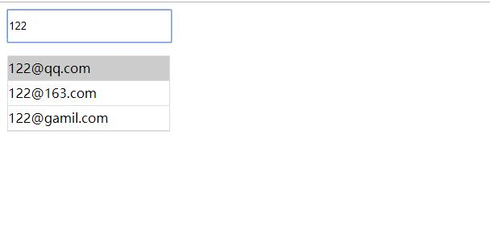

# 练习1

### 一、编写一个自动补全邮箱的功能

要求：
    1. 在输入框输入内容时候自动 列出 输入框的内容+不同邮箱后缀名称的候选项
    2. 鼠标选择候选项时自动填充到输入框中
    3. 使用键盘上下按键时 可以在候选项中上下选中候选项 按回车键时可以选中候选项的内容到输入框中





### 二、编写一个搜索功能

```js
 [
    '张三',
    '李四',
    '老王',
    '赵柳',
    '金科',
    '张四'
]
```

要求：

    1. 在输入框输入内容的时候 自动列出跟上面内容相匹配的值
    比如我输入四 就能匹配出 李四和张四 的候选列表 
    比如我输入张就能匹配出 '张三' '张四' 的候选列表 

    2. 可以通过键盘上下选择候选列表

    3. 使用键盘上下按键时 可以在候选项中上下选中候选项 按回车键时可以选中候选项的内容到输入框中